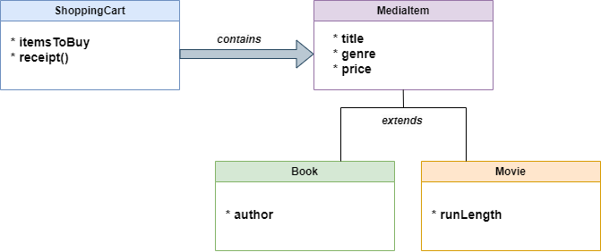
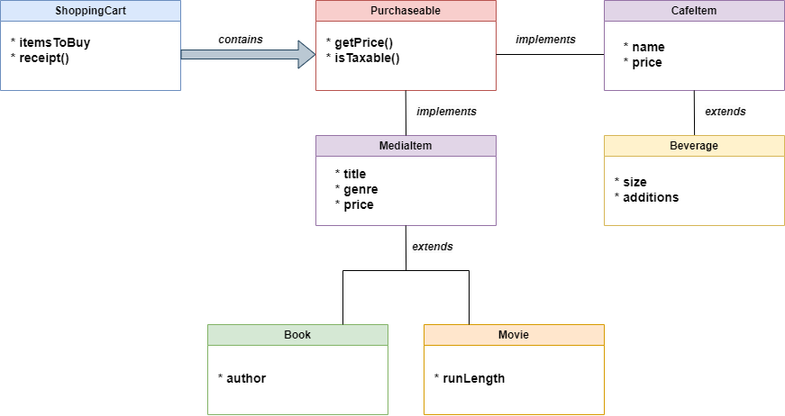

<h1 align="center">Bookstore Application</h1>
<h2>About: </h2>
This is a Java application that enables the user to purchase media items (books, movies, and music) from a local bookstore, <strong>Books & Beans</strong>. Upon checkout, the user receives a receipt detailing the number of books they purchased, the subtotal, tax, and total. Afterwards, the user receives a coupon for 15% off a beverage from the café!

<h2>Purpose: </h2>
This is a project I started while I was a student at Tech Elevator. I built this project for two reasons: 

<ol>
  <li>I wanted to share what I learned about Object-Oriented Programming (OOP).</li>
    <li>I'm an avid reader and passionate about supporting independent bookstores.</li>
</ol>
<h2>🏗️ Features in progress: </h2>
<ul>
  <li>Expanding on the command-line program so it prompts the user to fill in the desired media item they would like to purchase</li>
  <li>Writing unit tests</li>
  <li>Adding a graphical user interface</li>
</ul>

<h2>How my project incorporates the principles of OOP:</h2>
<h3>Encapsulation</h3>

<strong>Encapsulation</strong> involves hiding state (data members) and enabling users to access data using public methods. In doing so, the integrity of the data is maintained.

<strong>💻 Example:</strong>
 The Book class holds the String data members <em>title</em>, <em>author</em>, <em>genre</em>, and <em>price</em>. These data members are declared with the <strong>private</strong> access-modifier to safely encapsulate the state of the object. This will restrict access to the internal state of the class, only allowing them to be changed through public getter and setter methods such as getAlbum() or setArtist().
 
<h3>Inheritance</h3>

<strong>Inheritance </strong>is achieved when one class inherits state and behavior from another class. This could be a subclass extending from a superclass, or a class implementing an interface. Inheritance increases reusability and reduces code duplication.

<strong>💻 Example:</strong> For this application, the user can purchase a book, movie, or album. These objects share some of the same data members such as <em>title</em> <em>genre</em>, and <em>price</em>. By creating a superclass called <strong>MediaItem</strong>, inheritance is achieved as the Book, Music, and Movie classes now extend from MediaItem. They pass the "IS-A" relationship test: we can say that a book <em>is a </em> media item and a movie <em>is a </em> media item as well.

<ul>
  <li>Note: I changed the modified in MediaItem from 'private' to 'protected' so the data members can be accessed within their own package, but still remain private outside of the package.</li>
</ul>

<h3>Polymorphism</h3>

<strong>Polymorphism </strong> means "many forms" and it allows us to perform a certain action in multiple ways.

<strong>💻 Example:</strong> Any item that the store sells is 'purchasable', so I created an interface that defines a contract of properties and methods that any class implementing it must define. The ShoppingCart class must now implement the following methods: getPrice() and isTaxable(). For this application, purchasable items may take on many forms such as a cozy mystery novel, a soothing jazz album, or a grande vanilla cold brew.

<h4>What I learned:</h4>
<ul>
  <li>How to safely encapsulate state through the use of private and public access modifiers.</li>
  <li>How to write constructors, and their role in furthering encapsulation.</li>
  <li>How to create instances of a class, and make use of their public methods.</li>
  <li>Used inheritance by refactoring a class into a superclass and subclass.</li>
  <li>Define an interface that describes some common features that otherwise different objects may have.</li>
  <li>Implement an interface inside a class by implementing the methods defined on that interface.</li>
</ul>
